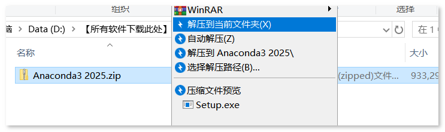
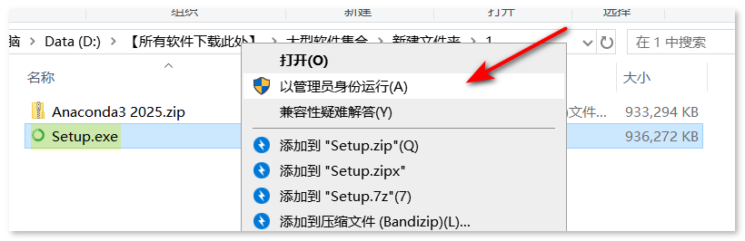
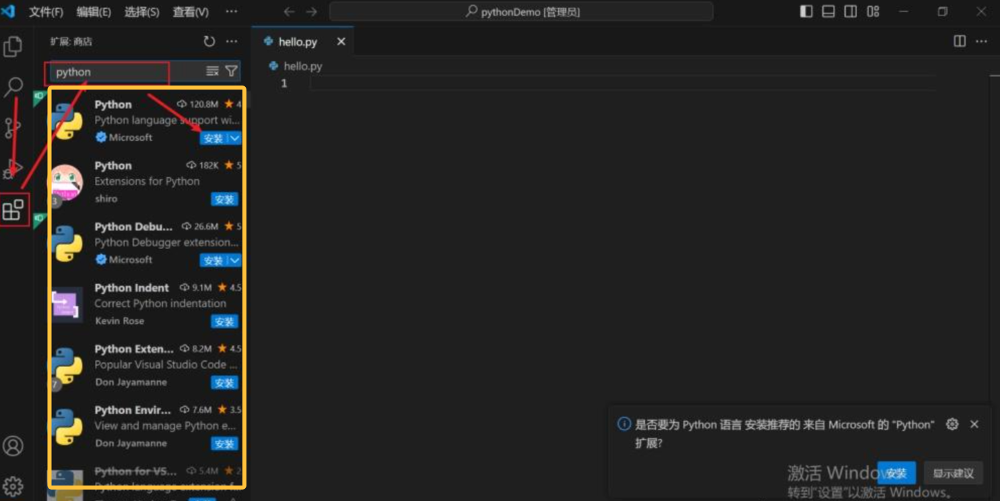

# 旅游智能体项目技术文档

# 旅游智能体Agent使用技术框架

# 一、项目框架概述


Ai旅行规划智能体主界面

## 1\.前端使用HTML\+JS\+css没有使用额外框架

由于智能体前端页面相对简单，为了让同学们更好的吸收理解我们就直接用HTML\+CSS\+JS，力求简单高效、易吸收为原则

## 2\.后端FastApi

后端我们使用FastApi，为什么选择它。主要是因为它是快速轻量的web后台，对应想快速完成web开发并且不想使用臃肿的web框架特别有用。目前FastApi慢慢成为主流

## 3\.使用openai\-agetns框架

目前主流的agent开发框架有以下几个：

|框架|开发商|核心特点|适用场景|学习曲线|
|---|---|---|---|---|
|**LangChain**|LangChain Inc|生态最成熟，组件最丰富|通用Agent开发|中等|
|**AutoGen**|Microsoft|多Agent协作强大|复杂协作任务|较高|
|**CrewAI**|CrewAI|角色扮演，流程化|团队协作模拟|较低|
|**Dify**|[Dify\.ai](http://Dify.ai)|可视化编排|快速原型和业务|低|
|Openai\-Agents|openAI|精简的 Agent 开发方法|轻量级、快速搭建业务|较低|

本项目选择openAi\-Agents开发框架结合FastApi来进行快速开发，对于初学者来说学习曲线不会陡峭，通过多行代码就可以快速搭建一个智能体，能让你所见即所得，下面代码演示：

```Python
from agents import Agent,Runner
from agents import OpenAIChatCompletionsModel
from openai import AsyncOpenAI
from dotenv import load_dotenv
import os

load_dotenv()
#1.需要确定你要连接的大模型，
#2.你的api可以

DASHSCOPE_API_KEY=os.getenv("DASHSCOPE_API_KEY")
AMAP_KEY=os.getenv("AMAP_KEY")
MODEL_NAME=os.getenv("MODEL_NAME")

#创建一个最间的智能体:
client=AsyncOpenAI(api_key=DASHSCOPE_API_KEY,base_url=DASHSCOPE_API_KEY)
main_agent =Agent(
    name='main_agent',
    model=OpenAIChatCompletionsModel(model=MODEL_NAME,openai_client=client),
    instructions='你是一个AI私人助理，帮我解决生活、学习上的问题。请直接回答用户的问题，不要输出工具调用的中间过程。'
)

```

# 二、Agent基本概念

## 1\.大模型和智能体的关系

很多同学搞不清楚大模型和智能体到底有什么区别，或者两者直接关系。这里用一句话来表示：大模型是具备海量知识的大脑，但是没有手脚，它没办法帮你订车票，写文档，因此需要你编写工具来完成订车票的工作，这个工具就叫智能体。

想象一下这个场景：

**传统的ChatGPT对话：**

- **你：「帮我规划一次周末去京都的旅行」**

- **ChatGPT：「当然！京都是个美丽的城市，你可以考虑参观清水寺、金阁寺\.\.\.建议提前预订酒店\.\.\.」**

- **你：（需要自己去各个网站查机票、订酒店、规划路线）**


**用一句话总结：Agent = LLM（大脑） \+ 工具（手脚） \+ 记忆（经验） \+ 规划（智慧）**

## 2\.Agent四大组成部分解析

这个架构可以分为**四个核心层**：

#### 第一层：感知层（Perception Layer）

- **作用**：接收并理解用户输入

- **组件**：用户输入 → 大语言模型理解

- **类比**：就像人的耳朵和眼睛

#### 第二层：认知层（Cognition Layer）

- **作用**：分析、推理、规划

- **组件**：LLM Brain \+ 规划模块 \+ 推理引擎

- **类比**：就像人的大脑

#### 第三层：执行层（Execution Layer）  40%工作量

- **作用**：调用各种工具完成任务

- **组件**：工具集（搜索、代码、API等）

- **类比**：就像人的手脚

#### 第四层：记忆层（Memory Layer）  60%工作量

- **作用**：存储和检索信息

- **组件**：短期记忆 \+ 长期记忆

- **类比**：就像人的记忆系统

**我们刚开始学就只需要知道感知层就是我们用户输入的请求，至于认知层对我们来说就是黑盒子，我们不需要关注，所有的智能体开发核心工作量都压在执行层上的工具编写，以及记忆管理。其实这些都是用python来编写代码。**

至于其它的很多内容比如：规划方法 ReAct框架、Plan\-and\-Execute先计划后执行等等，不需要详细了解否则你会头晕，只有边做项目边把理论提炼出来你才有感觉！

# 三、开发环境搭建

## 1\.Anaconda3安装

Python的核心优势之一是有很多第三方库支持，单独安装python是默认没有安装其它库的。往往是一个项目需要安装库很多，其它项目也要安装其它库，如果不加区分。很多库会互相影响，导致使用困难。所以要做隔离。Anacodna3就是做这个动作的

**1、下载地址**：[https://pan\.quark\.cn/s/b179ab4b98f2](https://cloud.tencent.com/developer/tools/blog-entry?target=https%3A%2F%2Fpan.quark.cn%2Fs%2Fb179ab4b98f2&objectId=2611851&objectType=1&contentType=markdown)

**2、安装步骤**

1解压安装包




2右键点击Setup以管理员开始安装



3\.开始安装


常用conda命令

```Plain Text
#查看虚拟环境
conda info -e
#创建虚拟环境
conda create -n your_env_name python=your_python_version
#删除虚拟环境
conda remove -n your_env_name --all
#进入指定环境
conda activate your_env_name
#退出指定环境
conda deactivate your_env_name
# 设置虚拟环境默认目录
conda config --add envs_dirs D:/conda_envs
```

对于本次旅游智能体项目第三方库名称如下：

```Shell
fastapi>=0.110.0
uvicorn>=0.29.0
openai-agents>=0.0.6
openai>=1.20.0
pydantic>=2.6.0
python-dotenv>=1.0.0
requests>=2.31.0
```

通常来说如果我们需要安装7个python库，但是一个个手动输入比较麻烦，我们通常把这些库名放入一个文本文档中，通过以下命令

```Plain Text
pip install -r requirements.txt
```

## 2\.开发工具VSCode

使用vscode中安装pyhon插件：

Vscode支持丰富的插件生态系统，其中Python插件提供了许多有用的功能。在Vscode中，点击左侧的扩展图标，搜索并安装"Python"插件。



安装后通过ctrl\+shif\+p快捷键选择对应的解释器


# 四、动手开始智能体项目开发

## 1\.创建coda环境安装 OpenAI\-agents

```Plain Text
//创建一个名为StudyAgent的虚拟环境,该环境默认使用 python3.10版本
conda create -n StudyAgent  python=3.10
//安装对应的第三方库包
pip install -r requirements.txt
//激活当前环境 
conda activate StudyAgent
```

## 2\.牛刀下试\-\-第一个Agent 的hellowrold

所有Agent要接入大模型都必须提供三个信息：

1. 一个是大模型的名称，成为ModelName。

2. 一个是模型的url连接。告诉Agent你要连接的大模型地址

3. APIkey:只有在大模型上注册创建后就会自动生成密钥

这些信息一般都是要用文本保存起来，这个文本就叫环境配置文本，通常叫 \.env文件

```Plain Text
DASHSCOPE_API_KEY=你的阿里千问的Key
AMAP_KEY=高德地图的Key
JUHE_KEY=juhe_xxxxxxxxxxxx
OPENAI_AGENTS_DISABLE_TRACING=1
AMAP_KEY=76e03e446430b2395e1e2f39735df78b
```

在vscode工作目录下创建main\.py代码文件。

```Python
from agents import Agent, Runner, function_tool
from dotenv import load_dotenv
from agents import OpenAIChatCompletionsModel
from openai import AsyncOpenAI
import asyncio
import os
import requests
from monitor_hook import MonitorHook
from pydantic import BaseModel,Field
from typing import Annotated
load_dotenv()  #通过该函数读取.env文本里的apikey相关信息

DASHSCOPE_API_KEY = os.getenv("DASHSCOPE_API_KEY") #获取对应的值
DASHSCOPE_BASE_URL =os.getenv("DASHSCOPE_BASE_URL")
MODEL_NAME = os.getenv("MODEL_NAME")
AMAP_KEY = os.getenv("AMAP_KEY")
```

上面代码从\.env文本中读取环境变量，至于导入的那些包后面都会讲解，大家不要着急。

现在各个Agent框架的作用是极大简化Agent开发的复杂度。OpengAi\-Agents框架创建Agent步骤

1\.把api\-key，url链接，大模型名称相关值和Agent框架关联

```Plain Text
client = AsyncOpenAI(api_key=DASHSCOPE_API_KEY, base_url=DASHSCOPE_BASE_URL)
```

这个AsyuncOpenAI是框架封装的类，里面包含和大模型相关的属性，通过上面代码把属性赋值给client变量，现在马上进入最核心代码创建一个Agent

```Plain Text
main_agent = Agent(
    name="main_agent",
    model=OpenAIChatCompletionsModel(model=MODEL_NAME, openai_client=client),
    instructions='你是一个AI私人助理，帮我解决生活、学习上的问题。请直接回答用户的问题，不要输出工具调用的中间过程。',
)
```

关键点：OpenAIChatCompletionsModel这个函数把模型名称和智能体其它相关属性进行强关联

instructions：这个就是我们常说的系统提示词，这里你要告诉大模型这个agent是扮演什么角色。

下面代码就是实现一个最简单的Agent

```Plain Text
async def LLM_Chat():
   result = await Runner.run(main_agent, "你是谁？")
   print(result.final_output)

if __name__ == "__main__":
    asyncio.run(LLm_Chat())
```

运行后结果显示如下说明你已经完成一个最简单的Agent：


## 3\.初露锋芒\- Agent进阶

到目前为止，我们用代码的形式来实现和大模型交互，可以通过多次向大模型提出问题，来模拟多轮对话，代码如下：

```Python
async def LLm_Chat():
    print("第一轮对话:你是谁？:\n")
    print("模型思考中....\n")
    hook=MonitorHook()
    # 增加 max_turns 参数
    result = await Runner.run(main_agent, "你是谁？")
    print(result.final_output)

    print("\n第二轮对话:请把北京好玩的景点给我介绍下，内容要简短些:\n")
    print("模型思考中....\n")
    result = await Runner.run(main_agent, "请把北京好玩的景点给我介绍下，内容要简短些")
    print(result.final_output)
```

运行结果如下：


但是这里有个问题，如果你叫大模型帮你把你自己电脑上的文件帮忙整理下把文件归类存放。大模型就没辙了，因为它没有手脚干不了。这个时候function calling 就出现了。

## 4\.function calling 函数工具


这里特别注意的一点是：大模型是调用不了函数的，它是只能根据你提供的函数声明，参数类型的解释来推理，把合理的数据赋值给参数。执行的任务还是丢给本地程序运行，程序运行完成后的结果一般是json数据，返回给大模型，让大模型自己输出内容。

```Python

# 1. 定义工具（Functions）：这是给大模型看的“说明书”
tools = [
    {
        "type": "function",
        "function": {
            # 【核心关键词 1: description】
            # 不要只写 "查询航班"，要写清楚触发条件、边界和参数要求。
            "description": "查询国内航班的实时状态。当用户询问航班是否延误、起飞时间、到达时间时调用。注意：仅支持中国国内航班，不支持国际航班。",
            "name": "get_flight_status",
            "parameters": {
                "type": "object",
                # 【核心关键词 2: required】
                # 明确告诉模型，没有这两个参数绝对不允许调用该函数，防止模型瞎编。
                "required": ["flight_no", "date"],
                "properties": {
                    "flight_no": {
                        "type": "string",
                        "description": "航班号，包含航司代码和数字。",
                        # 【核心关键词 3: sample (示例)】
                        # 给模型一个正确的格式参考，防止它输出 'CA-1234' 这种带横杠的错误格式。
                        # 注意：千万不要用 'xxx' 或 'example' 作为示例！
                        "examples": ["CA1234", "MU5678"] 
                    },
                    "date": {
                        "type": "string",
                        "description": "航班日期，格式必须为 YYYY-MM-DD。",
                        "examples": ["2024-05-20"]
                    },
                    "status_type": {
                        "type": "string",
                        # 【核心关键词 4: enum (枚举)】
                        # 限制模型只能从这几个词里选，彻底杜绝它返回 'delayed' 或 'late' 等不规范的词。
                        "enum": ["scheduled", "delayed", "cancelled", "landed"],
                        "description": "用户想要查询的具体状态类型，如果用户没提，默认不传此参数。"
                    }
                }
            }
        }
    }
]
```

上面的代码是直接使用原始的函数工具声明，格式比较复杂编写麻烦。但是对于开发者来说肯定是要知道的。

openai\-agents框架简化这个步骤，比如我希望大模型能够帮我查找某个城市的天气情况，这个时候你就要使用自己设计的函数。

在 AI 智能体（Agent）和 LLM 应用开发中，Pydantic 库扮演着“数据守门员”和“结构设计师”的核心角色。简单来说，它的作用是将大模型（LLM）返回的、容易出错的自由文本（如 JSON 字符串），转化为 Python 中类型安全、经过严格验证的结构化对象。

Pydantic 已经成为 AI 开发领域的事实标准。无论是 OpenAI Agents SDK、LangChain，还是 Anthropic 和 Google 的 SDK，底层都大量使用了 Pydantic 作为验证层。例如，在 openai\-agents 框架中，你只需使用 @function\_tool 装饰器，框架就会在底层自动利用 Pydantic 完成参数的提取、Schema 生成和校验

```Python
from pydantic  import BaseModel)
class Weather(BaseModel):
    city: str = Field(description='城市名称')
    weather_info: str = Field(description='天气情况描述')
    temperature: str = Field(description='温度')

```

上面代码定义了查询天气返回的标准数据类，现在我们可以定义天气查询函数SearchWeather。

```Plain Text
@function_tool
def SearchWeather(city:str,address:str="") -> Weather:
```

@function\_tool 这个是框架的关键词，表示后面的函数是会被大模型“看到”

要获取真实实时天气数据，肯定要借助第三平台获取数据，这里我们使用高德提供的web服务器api获取天气数据


通过申请AP Ikey，就可以查询高德天气AP服务，这里大家可以到查询天气的URL链接，马上我们就要关注，提交查询天气的json数据格式：


以及高德系统会返回给我们的json数据格式：

实况天气每小时更新多次，预报天气每天更新3次，分别在8、11、18点左右更新。由于天气数据的特殊性以及数据更新的持续性，无法确定精确的更新时间，请以接口返回数据的 reporttime 字段为准


```Python
@function_tool
def SearchWeather(city:str,address:str="") -> Weather:
    """
    通过城市编码查询实时天气。
    注意：adcode 必须通过高德API 获取。
    """

    url = "https://restapi.amap.com/v3/geocode/geo"
    req_params = {
        "key": "76e03e446430b2395e1e2f39735df78b",
        "city": address,
        "address": city,
        "output": "json"
    }

    res = requests.get(url, params=req_params, timeout=5).json()
    try:
        if res.get("status") == "1" and res.get("geocodes"):
            adcode=res["geocodes"][0]["adcode"]
        else:
            raise ValueError(f"获取城市地理位置编码失败:{res.get('info','未知错误')}")
    except Exception as e:
        raise ValueError(f"地理API请求失败: {str(e)}")
    
    weather_url = "https://restapi.amap.com/v3/weather/weatherInfo"
    params = {
        "key": "76e03e446430b2395e1e2f39735df78b",
        "city": adcode,
        "output": "json"
    }
    try:
        weather_res = requests.get(weather_url, params=params, timeout=5).json()
        if weather_res.get("status") == "1" and weather_res.get("lives"):
            live = weather_res["lives"][0]
            # 严格返回 Weather 模型对象
            return Weather(
                city=city,
                weather_info=live['weather'],
                temperature=live['temperature']
            )
        else:
            raise ValueError(f"天气数据获取失败: {weather_res.get('info', '未知错误')}")
    except Exception as e:
        raise ValueError(f"天气API请求失败: {str(e)}")
```

这里要获取天气参数，那就要获取对应城市的编码，然后获取地理位置编码后才能够获取天气信息。


同样的看到这个信息就应该知道必须根据特定的json格式来发送数据给高德web服务器


同样返回的数据结构，我们也要很清楚看下面的图：


设计完function tool 函数后，记得要在Agent中添加tools关键属性

```Plain Text
# 初始化客户端和 Agent
client = AsyncOpenAI(api_key=DASHSCOPE_API_KEY, base_url=DASHSCOPE_BASE_URL)
main_agent = Agent(
    name="main_agent",
    model=OpenAIChatCompletionsModel(model=MODEL_NAME, openai_client=client),
    **tools=[SearchWeather],  #这行把函数和大模型挂钩**
)
```

### 4\.1高德json数据解析

高德天气 API 返回是标准 JSON 字符串，Python 中用**dict 字典**数据结构接收解析，内置`json`模块完成 json 字符串 ↔ python 字典转换。

关键点

1\.requests 拿到接口响应，\.json\(\)方法直接把返回 JSON 转成 Python 字典 \(dict\)，最常用

2\.字典通过\["key"\]取值，嵌套 JSON 就多层\["key1"\]\["key2"\]向下取

3\.高德天气接口返回结构：status、lives实时天气 / forecasts预报数组

我们先看下高德返回的json数据结构是怎么样的，下面是某个城市的天气情况数据

```JSON
{
    "status": "1",
    "count": "1",
    "info": "OK",
    "infocode": "10000",
    "lives": [
        {
            "province": "福建",
            "city": "福州市",
            "adcode": "350100",
            "weather": "多云",
            "temperature": "28",
            "winddirection": "东南",
            "windpower": "3",
            "humidity": "65",
            "reporttime": "2026-08-12 10:30:00"
        }
    ]
}
```

再看下JSON类型和pyton对应的数据结构对照   

两种JSON解析方式

1\.resp\.json \(\)【推荐】

requests 内部自动调用 json\.loads，直接得到 python dict 对象，业务首选。

2\.手动 json\.loads \(\)

如果拿到原始文本字符串，手动解析：

现在代码模拟读取Json数据天气数据

```Python
import json

# ----------------------
# 1. 直接把高德返回的JSON写在代码中，作为字符串
# ----------------------
amap_weather_json_str = '''
{
    "status": "1",
    "count": "1",
    "info": "OK",
    "infocode": "10000",
    "lives": [
        {
            "province": "福建",
            "city": "福州市",
            "adcode": "350100",
            "weather": "多云",
            "temperature": "28",
            "winddirection": "东南",
            "windpower": "3",
            "humidity": "65",
            "reporttime": "2026-08-27 10:30:00"
        }
    ]
}
'''

# ----------------------
# 2. json.loads()：JSON字符串 → Python数据结构（dict + list）
# ----------------------
data = json.loads(amap_weather_json_str)

print("==== Python解析后的数据类型 ====")
print(f"data 的类型: {type(data)}")  # dict 字典
print(f"data['lives'] 的类型: {type(data['lives'])}") # list 列表

# ----------------------
# 3. 读取提取数据，和接口返回解析用法完全一样
# ----------------------
if data["status"] == "1":
    lives = data["lives"]   # list
    weather = lives[0]      # 取列表第0个元素，dict

    print("\n==== 提取天气信息 ====")
    print(f"省份：{weather['province']}")
    print(f"城市：{weather['city']}")
    print(f"天气：{weather['weather']}")
    print(f"温度：{weather['temperature']} ℃")
    print(f"风向：{weather['winddirection']}")
    print(f"风力：{weather['windpower']} 级")
    print(f"湿度：{weather['humidity']} %")
    print(f"更新时间：{weather['reporttime']}")

# ----------------------
# 4. 把Python对象再格式化输出漂亮的JSON字符串（用于打印、传给Agent大模型）
# ----------------------
print("\n==== 格式化输出JSON字符串 ====")
pretty_json = json.dumps(data, ensure_ascii=False, indent=2)
print(pretty_json)
```

## 5\.前端页面设计

前端页面只使用最简单的html\+js\+css结构，初学者要把所有关注点放在Agent相关技术上其它业务尽量简化，我们来看下前端页面效果。


### 5\.1HTML概念

超文本标记语言（英语：HyperText Markup Language，简称：HTML）是一种用于创建网页的标准标记语言。

您可以使用 HTML 来建立自己的 WEB 站点，HTML 运行在浏览器上，由浏览器来解析。

其实就是大家看到的网页上的所有内容包括列表，案例，图形等等都是用字符按照规定格式编写，然后浏览器程序会读取并显示出来


下面是最常用的几个标签元素的含义，给大家罗列出来

- \<\!DOCTYPE html\> 声明为 HTML5 文档

- \<html\> 元素是 HTML 页面的根元素

- \<head\> 元素包含了文档的元（meta）数据，如 \<meta charset="utf\-8"\> 定义网页编码格式为 utf\-8。

- \<title\> 元素描述了文档的标题

- \<body\> 元素包含了可见的页面内容

- \<h1\> 元素定义一个大标题

- \<p\> 元素定义一个段落

- \<div\> 标签的核心作用就是作为一个通用的块级容器，专门用来对页面内容进行逻辑分组和布局，它本身没有任何语义。

这里就需要了解些前端页面开发的简单知识，以下代码：

```HTML
<!DOCTYPE html>
<html lang="zh-CN">
<head>
    <meta charset="UTF-8">
    <title>AI旅游智能助手</title>
    <link rel="stylesheet" href="/static/css/style.css">
</head>
<body>
<div class="container">
    <h1>AI旅游智能助手</h1>
    <div class="chat-box" id="chatBox"></div>
    <div class="input-area">
        <input type="text" id="userInput" placeholder="问我：北京3日游路线、上海酒店推荐、广州到成都机票...">
        <button onclick="sendMessage()">发送</button>
    </div>
</div>
<script src="/static/js/app.js"></script>
</body>
</html>
```

### 5\.2 Div标签作用

\<div\> 是构建网页布局最基础的“积木”。它本身不改变内容的显示     方式（默认是块级元素，独占一行），主要用来将相关的 HTML 元素 包裹在一起，形成一个独立的区域，以便通过 CSS 进行统一的样式控制、定位或响应式布局。

### 5\.3 JavaScript语言

JavaScript 是 Web 的编程语言。所有现代的 HTML 页面都可以使用 JavaScript。

通过JS语言我们可以方便的控制Html上的各种组件：可以获取组件的值、用户点击按钮的时候可以响应

前端页面核心在于app\.js 文件中的sendMessage 这个JS代码，所有用户的需求都是通过这个方法调用传递给后端Agent框架。

```JavaScript
async function sendMessage() {
    const text = userInput.value.trim();
    if (!text) return;
    addMessage(text, true);
    userInput.value = '';
    sendBtn.disabled = true;
    userInput.disabled = true;
    showThinking();

    try {
        const res = await fetch(API_URL_CHAT, {
            method: 'POST',
            headers: {'Content-Type': 'application/json'},
            body: JSON.stringify({message: text, user_id: 'web_user'})
        });

        if (!res.ok) throw new Error(`HTTP ${res.status}`);
        const data=await res.json();
        addMessage(data.data|| '服务器异常');

    } catch (e) {
        removeThinking();
        addMessage('连接后端失败，请检查服务是否启动');
    } finally {
        sendBtn.disabled = false;
        userInput.disabled = false;
        userInput.focus();
    }
}
```

## 6\.后端Python开发框架对比 

目前基于Python后台开发框架有下面这些：

|框架名称|核心优点|核心缺点|适用场景|
|---|---|---|---|
|<br><br>Django|1. 内置全套组件：ORM、Admin 后台、表单验证、权限、缓存、会话、安全防护（CSRF/XSS）<br>2. 完整生态，文档完善，社区庞大<br>3. 自带数据库迁移、后台管理系统，开箱即用<br>4. 安全机制默认开启，企业级安全标准|1. 耦合度高，灵活度差，轻量化场景冗余<br>2. 同步阻塞架构，高并发 IO 场景性能一般<br>3. 自定义底层逻辑成本高<br>|企业后台管理系统、CMS 内容管理、电商后台、ERP、政务系统<br>|
|<br><br>Flask|1. 极简内核，只保留路由 \+ 模板，高度自由<br>2. 插件生态丰富（SQLAlchemy、Flask\-Login 等按需安装）<br>3. 学习门槛低，代码简洁灵活<br>4. 同步框架入门首选|1. 原生无 ORM、后台、表单，复杂功能需手动集成插件2\. 原生同步，高并发 IO 性能弱3\. 大型项目无规范约束，易代码混乱|中小型网站、内部工具、简单 API、爬虫配套后台、个人博客、初创小型业务、学习 Python Web<br>|
|<br><br>FastAPI|1. 原生异步 async/await，高性能，媲美 Go<br>2. 自动生成 OpenAPI 接口文档（Swagger/ReDoc）<br>3. 3\. Pydantic 强类型数据校验，自动参数解析4\. 类型提示完善，开发效率高，bug 更少<br>4. 5\. 兼容同步函数，学习成本低|1. 服务端模板渲染生态弱，不适合传统多页面网站<br>2. 重度 CPU 计算任务无天然优势（异步只优化 IO）<br>|前后端分离 API、微服务、高并发接口、爬虫调度服务、AI 模型推理接口、物联网后端、第三方开放平台。<br>|
|Django     Ninja|Django 生态 \+ FastAPI 风格异步接口，复用 Django ORM/Admin，自动生成 API 文档|仅用于接口开发，前端渲染能力依赖 Django 原生模板|已有 Django 后台，需要高性能异步 API 的混合项目|

## 7\.FastAPI 后台web搭建

FastApi是后台web服务器，在同级目录下创建main\.py文件。一般创建会固定按照以下步骤来编写代码：

```Plain Text
from fastapi import FastAPI,Request
from fastapi.responses import HTMLResponse,StreamingResponse
from fastapi.staticfiles import StaticFiles

app=FastAPI(title='旅游智能体应'

app.mount("/static", StaticFiles(directory="static"), name="static")

app.add_middleware(
    CORSMiddleware,
    allow_origins=["*"],
    allow_credentials=True,
    allow_methods=["*"],
    allow_headers=["*"],
)

@app.get("/",response_class=HTMLResponse)
async def home():
    html_path = Path(__file__).parent / "index.html"
    return html_path.read_text(encoding="utf-8")
    
@app.post("/api/chat")
async def chat(req:ChatRequest):
    result= await Runner.run(main_agent,req.message,hooks=hook)
    return {"code": 200, "data": result.final_output}    
    
if __name__=="__main__":
    import uvicorn
    uvicorn.run("main:app", host="0.0.0.0", port=8000, reload=True)    

```

运行成功结果如下：


### 7\.1 await fetch \(\) 完整讲解

fetch 是浏览器原生 JS，用来发 http 请求（调用 FastAPI 后端接口），返回 Promise，所以搭配 await 使用。

只能在 `async` 函数里面写 `await fetch(...)`；Node\.js 18\+ 也内置 fetch，低版本 node 需要安装包

**基础语法**

```JavaScript
async function demo() {
  const res = await fetch(url, options); // 发网络请求
  // res 是 Response 对象，不是直接拿到数据！
  const data = await res.json(); // 解析返回JSON
}
```

fetch 有两阶段：

await fetch\(\)：拿到响应对象 Response，只代表网络通了，不代表接口成功！哪怕后端返回 400、500，fetch 不会抛异常。

await res\.json\(\) / res\.text\(\)：读取响应体，解析数据。

常用参数 options（第二个参数）

```JavaScript
const options = {
  method: "POST", // GET / POST / PUT / DELETE
  headers: {
    "Content-Type": "application/json", // json格式请求体必备
    "Authorization": "Bearer xxx-token"  // 携带token
  },
  body: JSON.stringify({ name:"张三", age:18 }), // POST的json请求体，必须转字符串
}
```

# 五、你的第一旅行Agent

我们的整个智能体是由多个子智能体互相协作完成，比如路线规划智能体、景点信息查询智能体、酒店/车票预定智能体、天气情况预估智能体等等，根据我们这个整体设计我们的整个项目文件结构如下：

```Bash
lession_agetn/
|----main.py             #整个Fastapi的服务器入口
|----index.html           #旅行规则智能体的主页面
|----.env                #环境变量配置文件
|----config.py           #整个项目中核心的全局变量
|----requiremnet.txt     #整个项目的依赖库文件
|——————Agent_com         #目录存放所有智能体包括总调度智能，已经路线规划智能体，酒店预定智能体
|----main_agent.py      #主控制智能体，管理多个子智能体
|----route_agent.py     #路线规划智能
|----hotel_agent.py     #酒店规划智能体
|----traffic_agent.py   #车票预定智能体
```

简单版本路线规划智能体 route\_agent\.py

```Python
from agents  import Agent,OpenAIChatCompletionsModel
from openai  import AsyncOpenAI
from  config import MODEL_NAME,DASHSCOPE_API_KEY,DASHSCOPE_BASE_URL

client = AsyncOpenAI(api_key=DASHSCOPE_API_KEY, base_url=DASHSCOPE_BASE_URL)
model = OpenAIChatCompletionsModel(model=MODEL_NAME, openai_client=client)
route_agent=Agent(
    name="route_planning_agent",
    model=model,
    instructions="""你是自驾游路线规划专家，收到高德返回的精简线路数据后，按以下结构生成易读的结果：
    1. 【自驾总览】提取 origin/destination/total_distance_km/total_drive_hours/total_toll_fee/route_strategy
    2. 【分段行程】逐条列出 daily_segments 中每个路段：区间名称 → 里程 → 驾驶时长 → 道路类型 → 配套设施 → 路况提示
    3. 【出行提示】列出 global_tips 中的建议
    4. 结尾可附 2-3 条沿途游玩/住宿建议（基于途经城市推荐）
    5. 【沿途景点】列出 scenic_spots 中的景点信息，包含图片，价格短标签、门票评分、开放时间、门票价格
    6. 【终点景点】最后列出终点目的低的景点信息包含图片，价格短标签、门票评分、开放时间、门票价格
    要求：中文输出，数字直观，禁止编造不存在的路名或服务区。
    """
)
```

## 5\.1openai‑agents SDK Handoffs（智能体交接）

在任何复杂的智能体开发中都会存在多个子智能体交互数据的情况，因为很多复杂任务是由多个子智能体互相配合完成的，这个也叫智能体交接。

通俗类比：医院分诊台。分诊 Agent（triage）接待用户，判断业务类型，把整个会话控制权完整交给专科 Agent；专科 Agent 接手对话、自己调用工具、直接回复用户，分诊 Agent 退出循环不再参与后续对话。

核心本质：Handoff 是一个特殊的工具调用（function‑calling）。SDK 自动生成形如 transfer\_to\_xxx\_agent 的虚拟工具，模型判断需要转交时调用这个工具；Runner 捕获该工具调用，不执行普通函数，直接切换活跃 Agent，把对话上下文传给目标 Agent 继续跑循环

## 5\.2 Handoffs基础代码示例

还是之前的医院案例，比如用户要退款：triage 执行 handoff 交给 refund\_agent，refund\_agent 自己跟用户确认订单、处理退款，直接回复用户。

在比如用户需要写一份旅游方案：主 Agent 调用search\_agent\(as tool\) 查景点，拿到结果后主 Agent 自己整理输出旅游方案。

根据上面的业务规则，我们就可以写出简化的多智能体交接代码如下：

```Plain Text
from agents import Agent, handoff, Runner

# 子Agent：专门做退款
refund_agent = Agent(
    name="退款专员Agent",
    instructions="负责处理退款，向用户确认订单号，完成退款流程",
)

# 子Agent：专门做账单查询
billing_agent = Agent(
    name="账单专员Agent",
    instructions="查询用户账单，解释消费明细",
)

# 分诊Agent，配置handoffs
triage_agent = Agent(
    name="分诊总Agent",
    instructions="判断用户问题，退款交给退款专员，账单交给账单专员，普通问题自己回答",
    # 简单写法：直接传入Agent实例
    handoffs=[refund_agent, billing_agent]
)
```

当模型判断用户要退款，会自动调用 SDK 生成的虚拟工具：transfer\_to\_refund\_agent。

Runner 捕获到此调用，不再执行普通函数逻辑，切换当前活跃 Agent 为 refund\_agent，把完整对话历史交给 refund\_agent 继续运行

## 5\.3  路线规划智能体实现工具调用


